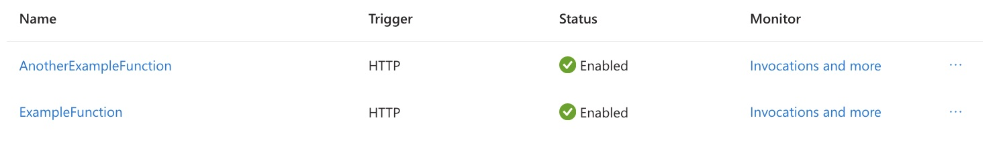
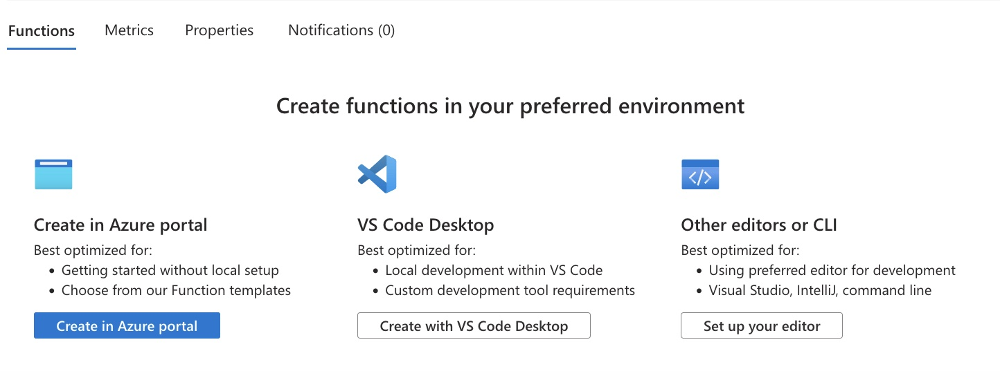
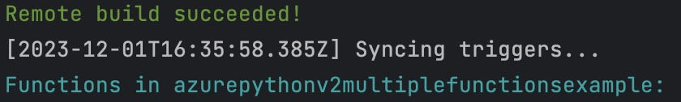

# Deploy multiple Azure Functions using the Python v2 programming model
[](https://choosealicense.com/licenses/mit/)

## Demo



## Background
When I wanted to deploy multiple functions into the same function app using the new Python programming model, 
I had a hard time getting my hands on any working examples of how to deploy multiple functions into the same function app.

Therefore I decided to publish a small example repository so that anyone after
me with the same questions has an easier time setting up their Azure Functions. 

Please note that I am by no mean an expert on Azure Functions, and can not guarantee that this is 
the best approach to do what you want to do. I am simply providing a solution which worked for me. 

### What this repository offers
- A simple example of how you can deploy multiple Azure Functions into your function app, using the (new) v2 Python programming model
- An example of how to import other Python code into your Azure Function (Spoiler: unlike in the v1 programming model, it now works like a "regular" Python import now)
- Besides the Python Code, this repository also provides you with all extra files needed to successfully deploy your function. 

### What this repository doesn't offer
- This is not an exhaustive documentation on Azure Functions in general. It is my objective to only provide a minimal working example that doesn't add any extra functionality, to keep it simple.
- Exhaustive explanations on the differences between the v1 and v2 Programming model.
- Integration with a pipeline to automatically deploy your function, you will have to take care of this yourself. While github offers a pretty convenient setup for this, I will also explain how to [deploy the function from your local computer directly to Azure](#Publish your functions to your Azure function app).
- Finally, this repository also doesn't cover [blueprints](https://learn.microsoft.com/en-us/azure/azure-functions/functions-reference-python?tabs=asgi%2Capplication-level&pivots=python-mode-decorators#blueprints)

## Prerequisites
Before you start, ensure you have the following installed:
- [Azure CLI](https://github.com/Azure/azure-cli)
- [Azure Functions Core Tools](https://www.google.com/url?sa=t&rct=j&q=&esrc=s&source=web&cd=&ved=2ahUKEwjG1Kiy0e6CAxWdhv0HHUMwCxEQFnoECA8QAQ&url=https%3A%2F%2Fgithub.com%2FAzure%2Fazure-functions-core-tools&usg=AOvVaw3z2UIBHsJ4iTMUsE-lGqby&opi=89978449)

## Installation and Setup
To use this repository:
1. Clone the repository to your local machine
2. If you plan to develop and test locally, install any required dependencies as specified in the repository

## Develop your functions
1. Add any function you would like to deploy to your function app to function_app.py
2. If you want to import Python code from different files, you can do so as you would in any other Python script:
    ```bash
    from code_to_import import helper_code
    ```
3. Make sure to add your dependencies to `requirements.txt`
4. Add `local.settings.json` to your .gitignore (I published it so that you could have a complete set-up to get you going.)
## Publish your functions to your Azure function app
_Note: You can also use an alternative way to deploy your functions, for example through the Github Actions pipeline which you can integrate quite easily while setting up the function app. While I personally prefer this setup, for proof-of-concepts I find it way quicker to deploy my function locally first._
1. Create the function app that you want to deploy your functions to in Azure.
2. Log in to Azure from your command line:
    ```bash
    az login
    ```
3. Publish your code to your function app:
    ```bash
   func azure functionapp publish <name-of-your-functionapp>
    ```

## Quick help on common issues
Sometimes I find Azure Functions very complicated to debug. A part of this is that when there is something wrong with your functions, 
Azure will still deploy it successfully, but then they simply won't appear in the portal. 
If this is happening to you as well, it will (probably) look like this:




You can also recognize this is happening directly after deploying it from your local machine, if it doesn't list any functions after the name of your function app (so you don't need to go to the portal to check if it's there.)


So far I haven't found any way to receive feedback on what went wrong in these cases, so I can only speculate. To help you debug 
these cases faster, here is a list of common bugs that caused my functions to not appear in the portal:

- Not working imports (e.g., because the name of the file changed, or I still used the ".package_name" addressing scheme from the v1 programming model)
- Using the functions' decorators in a wrong way, for example one time I tried to add an `@app.route(...)`decorator to a timer function (which doesn't make any sense ...)
- Forgetting to include dependencies in requirements.txt
- Generally any kind of spelling mistakes, e.g. `@app.function_nam` instead of `@app.function_name`

Also, on another note: if you know a way to get some kind of feedback on what went wrong in these cases, I would love it if you could tell me. Would save me an awful amount of time and nerves ;-).

## Contributions 
Contributions to this repository are very welcome. Please feel free to submit pull requests or open issues for discussion.
